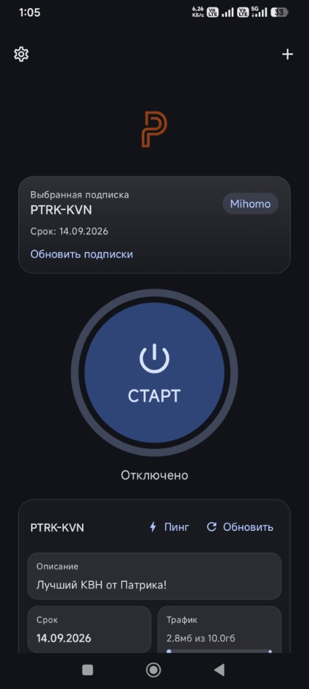
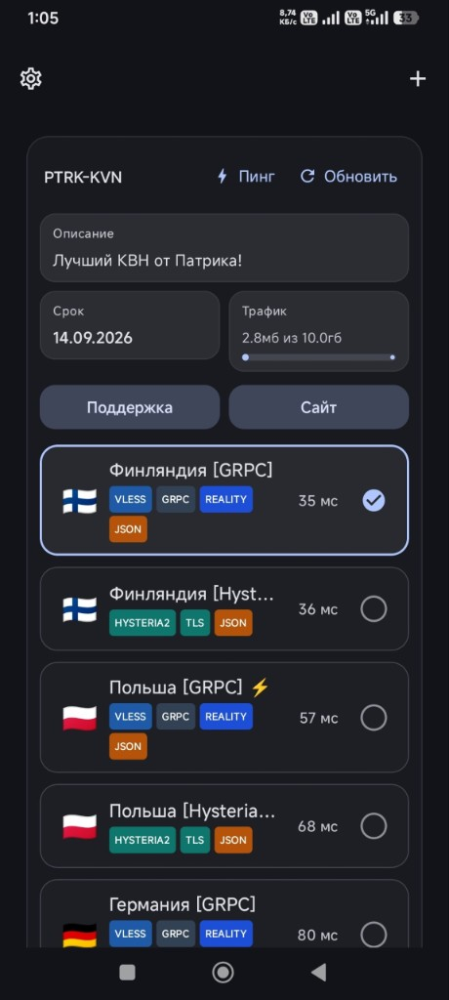
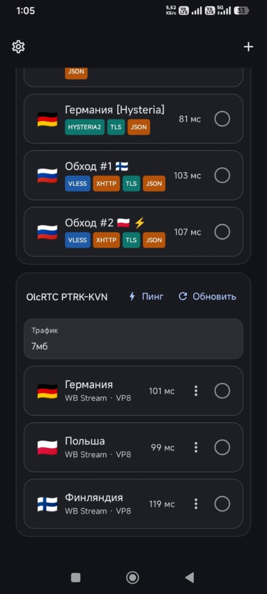

# PTRK-KVN

[](README.MD)
[](README.ru.md)
[](https://github.com/sweetbat/PTRK-KVN-app/releases)
[](https://t.me/ptrkkvn)
[](https://t.me/ptrkkvnbot)

**The dual-engine Android VPN client:** **Mihomo** + **olcRTC** in one app.

Paste a Remnawave subscription URL — the client imports Clash/Mihomo YAML **and** automatically adds the paired olcRTC subscription. Run modern proxy stacks (gRPC, Hysteria2, xHTTP) on Mihomo and an olcRTC node without juggling two apps.

> **Compatibility note:** Fully tested and confirmed working **100%** with the **PTRK-KVN** VPN service (also known as Patrick KVN / PTRK KVN). Other Remnawave panels may work, but PTRK-KVN is the reference setup we vouch for.

### Open from Remnawave subscription page

In the subscription-page app entry set:

```text
urlScheme: ptrkkvn://add/
```

Example deep link (Happ-style concatenation):

```text
ptrkkvn://add/https://drink.ptrkkvn.beer/mug/YOUR_TOKEN
```

That imports Mihomo from the HTTPS mug URL and auto-pulls `https://olcsub.ptrkkvn.beer/YOUR_TOKEN` (olcRTC). Requires PTRK-KVN **1.1.2+**.

<p align="center">
  
  &nbsp;
  
  &nbsp;
  
</p>

## Links

| | |
| --- | --- |
| **APK / source** | [GitHub Releases](https://github.com/sweetbat/PTRK-KVN-app/releases) |
| **News channel** | [t.me/ptrkkvn](https://t.me/ptrkkvn) |
| **Subscription bot** | [t.me/ptrkkvnbot](https://t.me/ptrkkvnbot) |

## Why dual-core?

Most clients pick **either** Clash Meta **or** an RTC/WebRTC-style stack. PTRK-KVN runs **both**:

| Engine | Role |
| --- | --- |
| **Mihomo** (Clash Meta) | Remnawave / Clash YAML — gRPC, Hysteria2, xHTTP, and other leaf protocols |
| **olcRTC** | Isolated `:olcrtc` process (Mobile SOCKS → `hev-socks5-tunnel`) so `libclash` and `libgojni` never share one Go runtime |

## How it works for you

1. Import your main Remnawave subscription URL (e.g. PTRK-KVN mug link).
2. The app loads Mihomo nodes from YAML.
3. It **automatically** pulls the companion olcRTC subscription when the URL matches the PTRK companion pattern.
4. Pick a Mihomo or olcRTC server and connect — one UI, two engines.

## Features

- Dual engine: Mihomo TUN path + olcRTC hev tunnel
- RU / EN UI (first-launch language picker)
- Ping, traffic quota, subscription refresh
- Mihomo routing (Минцифры whitelist on/off); torrents always direct
- Split tunneling, SOCKS5 proxy mode
- In-app updates from this repository

## Status

Android **arm64** is the primary target. Latest stable: [Releases](https://github.com/sweetbat/PTRK-KVN-app/releases).

## Build (Android)

Requirements: JDK 17+, Android SDK + NDK, Gradle wrapper in this repo.

```bash
./gradlew :androidApp:assembleDebug
```

```text
androidApp/build/outputs/apk/debug/androidApp-debug.apk
```

Native Mihomo libs: `androidApp/src/main/jniLibs/`  
Bundled olcRTC AAR: `sharedUI/olcrtc-bin/libs/`

## Credits

Forked from [alananisimov/olcbox](https://github.com/alananisimov/olcbox) (MIT).  
Mihomo integration inspired by FlClashX / PTRK libclash packaging.

## License

MIT — see [LICENSE](LICENSE).
