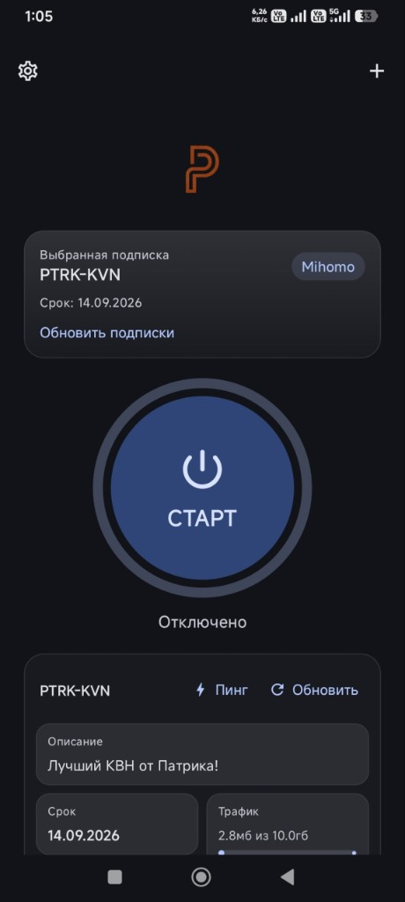
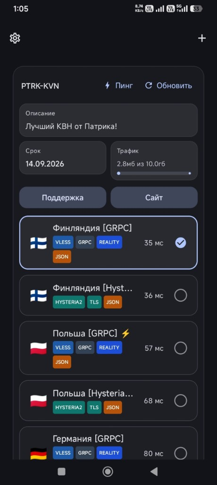

# PTRK-KVN

[](README.MD)
[](README.ru.md)
[](https://github.com/sweetbat/PTRK-KVN-app/releases)
[](https://t.me/ptrkkvn)
[](https://t.me/ptrkkvnbot)

**VPN-клиент на двух ядрах одновременно:** **Mihomo** + **olcRTC** в одном приложении.

Кидаешь ссылку на основную подписку Remnawave — клиент импортирует Clash/Mihomo YAML **и** автоматически добавляет парную подписку olcRTC. На Mihomo спокойно живут gRPC, Hysteria2, xHTTP; параллельно можно подключать olcRTC — без двух отдельных приложений.

> **Важно про совместимость:** отлично работает и **на 100% проверено** на VPN-сервисе **PTRK-KVN** (Patrick KVN / PTRK KVN). Другие панели Remnawave могут подойти, но эталон и гарантия — именно PTRK-KVN.

<p align="center">
  
  &nbsp;
  
  &nbsp;
  
</p>

## Ссылки

| | |
| --- | --- |
| **APK / исходники** | [GitHub Releases](https://github.com/sweetbat/PTRK-KVN-app/releases) |
| **Новостной канал** | [t.me/ptrkkvn](https://t.me/ptrkkvn) |
| **Бот подписки** | [t.me/ptrkkvnbot](https://t.me/ptrkkvnbot) |

## Зачем два ядра?

Обычные клиенты — это **либо** Clash Meta, **либо** RTC/WebRTC-стек. PTRK-KVN держит **оба**:

| Ядро | Задача |
| --- | --- |
| **Mihomo** (Clash Meta) | YAML Remnawave / Clash — gRPC, Hysteria2, xHTTP и другие протоколы |
| **olcRTC** | Отдельный процесс `:olcrtc` (Mobile SOCKS → `hev-socks5-tunnel`), чтобы `libclash` и `libgojni` не делили один Go-рантайм |

## Как пользоваться

1. Импортируй URL основной подписки Remnawave (например, mug-ссылку PTRK-KVN).
2. Приложение подтянет ноды Mihomo из YAML.
3. Для PTRK автоматически добавит companion-подписку olcRTC.
4. Выбери сервер Mihomo или olcRTC и жми старт — один интерфейс, два движка.

## Возможности

- Два движка: путь Mihomo + туннель olcRTC через hev
- Русский / English (выбор языка при первом запуске)
- Пинг, трафик, обновление подписки
- Маршрутизация Mihomo (белый список Минцифры вкл/выкл); торренты всегда напрямую
- Split tunneling, режим SOCKS5
- Обновления из этого репозитория

## Статус

Основная платформа — Android **arm64**. Актуальная сборка: [Releases](https://github.com/sweetbat/PTRK-KVN-app/releases).

## Сборка (Android)

Нужны: JDK 17+, Android SDK + NDK, Gradle wrapper из репозитория.

```bash
./gradlew :androidApp:assembleDebug
```

```text
androidApp/build/outputs/apk/debug/androidApp-debug.apk
```

Нативные библиотеки Mihomo: `androidApp/src/main/jniLibs/`  
AAR olcRTC: `sharedUI/olcrtc-bin/libs/`

## Благодарности

Форк [alananisimov/olcbox](https://github.com/alananisimov/olcbox) (MIT).  
Интеграция Mihomo — в духе FlClashX / PTRK libclash.

## Лицензия

MIT — см. [LICENSE](LICENSE).
